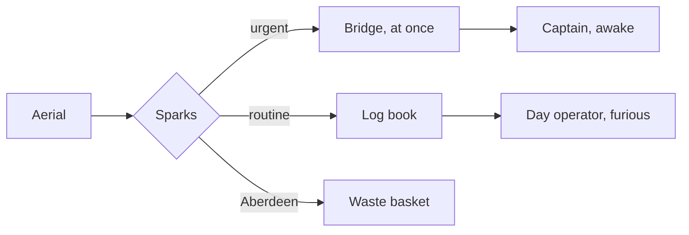

# The Night Operator's Handbook

For TEST-PLAN-1.0.md, area THM. Work on a copy. Written by Joe Sparks
(@joesparks on X), who designed the Red Sparks themes it is here to check.

**M.V. *Persistence* — Wireless Room — Third Watch**
*Issued to: Sparks. Read it in the red light. Do not switch on the white lamp.*

Welcome to the middle watch, which runs from midnight to four and belongs to
nobody. You are the only person aboard who is *paid* to be awake and the only
one who is any good at it. The lamp above your desk is red because the lookouts
on the bridge wing need their night vision and you need to not be the reason
they lose it. ~~White light is permitted in emergencies.~~ White light is not
permitted. Ask the Second Mate why.

> **Regulation 14(b).** The operator on watch shall maintain a continuous
> listening watch, a legible log, and a civil tongue.
>
> > *Marginal note, added in 1953 in a different hand:* two of these are
> > enforceable.

---

## What to look at while you read this

If you are testing a theme rather than standing a watch, this table is your
checklist. It is also, conveniently, the table test.

| Element            | What to check                          | Alignment |
| :----------------- | :------------------------------------: | --------: |
| Body text          | Bright enough to read, dim enough to live with | left |
| Headings           | Six levels below, each dimmer than the last | centre |
| List markers       | Bullets and numbers, both red, no blue  |     right |
| Misspellings       | The squiggle further down must be visible | left |
| Code block         | Keywords, strings, comments all distinct | centre |
| This table         | Header row, and every other row striped |     right |
| Mermaid diagram    | The one thing that will not be red      | left |

---

## Standing Orders

### Before you take the watch

1. Relieve the Second Operator, who will be asleep in the chair.
2. Check the log for anything marked **URGENT**, then check whether it is.
3. Confirm the aerial is still attached to the ship. This has come up.
4. Set the lamp to red. All the way to red.

### Frequencies and what may be said on them

#### 500 kHz — Distress and Calling

Silence periods are observed for three minutes on the quarter hour, during
which you say nothing, hear everything, and write it all down. This is the most
important nine-hundredths of your hour.

##### 425 kHz — Traffic

Position reports, weather, cargo, and the Chief Engineer's ongoing
correspondence with a supplier in Rotterdam about a pump.

###### 143 kHz — Unofficial

The cook's brother-in-law operates a set from a shed near Aberdeen and will
recieve you at almost any hour, whether or not you have transmitted. Log these
as *chatter*. Do not log them as traffic. The Captain reads the traffic.

---

## The Watch Checklist

- [x] Lamp red
- [x] Log open, pencil sharpened, `SILENCE PERIOD` marked
- [ ] Coffee, made quietly
- [ ] Apology drafted for the cook
- [ ] Aerial still attached
  - [ ] Visually
  - [ ] Electrically
  - [ ] Optimistically

Things that are **not** your responsibility, in descending order of how often
you will be asked about them:

- The ship's clock
- The passengers' radio reception
- The weather itself, as opposed to reports about it
- Whether the Chief's pump ever arrives
  - It does not
  - It is the *idea* of a pump

---

## The Log Parser

Every night's paper log is typed up by the day operator, who hates it. In 1987
somebody wrote this to do it instead, and it has been running ever since with
one comment that nobody dares remove.

```python
# Do not remove this line. We don't know why. — Sparks, 1987
import re
from datetime import datetime

BANDS = {500: "distress", 425: "traffic", 143: "chatter"}
CALLSIGN = re.compile(r"^[A-Z]{2}\d{1,2}[A-Z]{0,3}$")

def log_entry(line: str, *, watch: int = 3) -> dict | None:
    """Parse one line of the night log. Returns None for the cook."""
    stamp, call, khz, body = line.split("|", 3)
    if not CALLSIGN.match(call.strip()):
        return None                          # Aberdeen again, probably
    return {
        "at": datetime.fromisoformat(stamp),
        "call": call.strip(),
        "band": BANDS.get(int(khz), "unknown"),
        "urgent": body.count("!") >= 2 or "SOS" in body.upper(),
        "watch": watch,
    }
```

Run it with `python watchlog.py --night`, and never with `--fix`. The `--fix`
flag was added by the same person who wrote the comment.

---

## Where a Signal Goes



---

## Handing Over

At four o'clock the First Operator arrives, occassionally on time. Give them
the log, the chair, and one sentence about the night. One. They have been
asleep and you have not; whoever talks more is losing.

Then go up on deck before you turn in. Your eyes are still dark-adapted from
four hours of red light, which means that for about ninety seconds — and only
if you have done the watch properly, with the white lamp off — you will be able
to see the entire sky at once.

That is the actual reason for the red lamp. Regulation 14(b) does not mention
it.

> *End of watch. Log closed. Lamp still red.*

---

Themes: **View ▸ Theme ▸ Red Sparks**, and **Red Sparks 2X** for the same
palette at twice the size. Both ship with the app.

*Two words above are misspelled on purpose — one in the 143 kHz section, one in
the handover. If you cannot see a squiggle under either of them, the theme's
spelling underline has vanished into the background, which is the usual way a
good-looking dark theme turns out to be broken.*
