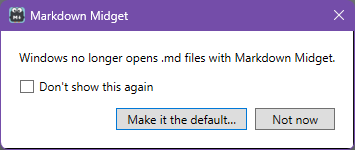
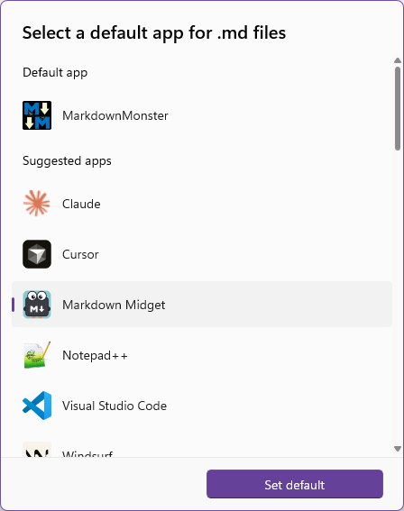
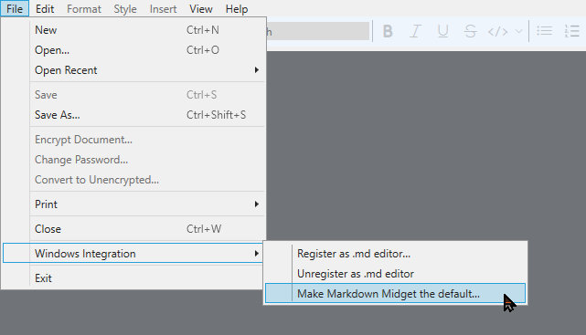
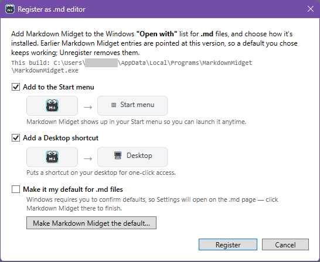
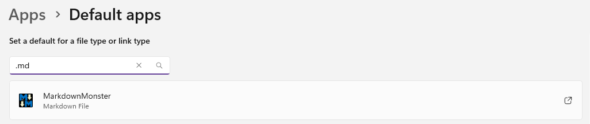

# Get .md files opening in Markdown Midget again after updating from 1.0.0-rc1

## Who this is for

This guide is for you if you used Markdown Midget's own update to go from 1.0.0-rc1
to 1.0.0-rc2. For some people, that update switched `.md` files back to another app.
If double-clicking a `.md` file now opens Notepad, Markdown Monster or another app
instead of Markdown Midget, this guide gets it back.

Windows lets only you choose which app opens a file type, so Markdown Midget can't
change it for you. It takes you to the right place in Windows Settings instead.

## The fastest way: use the notice

After the update, Markdown Midget shows a notice that Windows doesn't open, or no
longer opens, `.md` files with Markdown Midget.

1. Click **Make it the default…**. Windows Settings opens on Markdown Midget's own
   page, **Apps ▸ Default apps ▸ Markdown Midget**. If Settings opens on the main
   **Default apps** page instead, see
   [If Settings opens on the main Default apps page](#if-settings-opens-on-the-main-default-apps-page).
2. Under **Set default file types or link types**, find **.md**. Click the app shown
   under it, which is the app that opens `.md` files now.
3. In **Select a default app for .md files**, select **Markdown Midget**, then click
   **Set default**.
4. If you also want `.markdown` files to open in Markdown Midget, repeat steps 2 and 3
   for **.markdown**. The page also lists **.mdenc**, for encrypted documents.

The Settings wording may differ slightly by Windows version.

If Markdown Midget opens with unsaved work, a recovered document or the Help window,
the notice waits. It appears the next time Markdown Midget opens without them.

## If you closed the notice

The notice appears only once. To get to the same Settings page later:

1. In Markdown Midget, open **File ▸ Windows Integration ▸ Make Markdown Midget the default…**.
2. Follow steps 2 to 4 in the previous section.

## If Markdown Midget isn't listed in Settings

Windows lists Markdown Midget only after it's registered. If it isn't registered,
Markdown Midget says so when you click **Make it the default…**. To register it:

1. Open **File ▸ Windows Integration ▸ Register as .md editor…**.
2. Set **Add to the Start menu** and **Add a Desktop shortcut** the way you want them.
3. Tick **Make it my default for .md files**, then click **Register**.
4. Click **OK** on the message that confirms it. Settings then opens on the `.md`
   page. Choose **Markdown Midget** there to finish.

If you leave **Make it my default for .md files** unticked, open
**File ▸ Windows Integration ▸ Make Markdown Midget the default…** after registering
instead. The **Register as .md editor** window also has a button of the same name,
which works once Markdown Midget is registered.

## If Settings opens on the main Default apps page

On Windows 10 and early versions of Windows 11, Settings opens on the main
**Default apps** page instead of Markdown Midget's own page. If Markdown Midget
can't open Settings at all, it tells you, and you can open
**Settings ▸ Apps ▸ Default apps** yourself. On that page:

- **Windows 11:** Under **Set a default for a file type or link type**, type `.md` in
  the search box. Click the result, which shows the app that opens `.md` files now.
  Select **Markdown Midget**, then click **Set default** (on some versions, **OK**).
- **Windows 10:** Click **Choose default apps by file type**. Scroll to **.md**, click
  the app next to it, and select **Markdown Midget**.

The wording may differ slightly by Windows version.

## If nothing else works: choose it in File Explorer

1. Right-click any `.md` file and select **Open with ▸ Choose another app**.
2. Select **Markdown Midget**. If it isn't in the list, register it first, as
   described earlier.
3. Click **Always**. On Windows 10, select **Always use this app to open .md files**,
   then click **OK**.

## Will this happen again?

No. From 1.0.0-rc2 on, updating Markdown Midget or registering it again keeps the app
you chose for `.md` files. This one time, the update to rc2 was done by rc1.

If `.md` files ever stop opening in Markdown Midget again, the first start after the
next update tells you, with the same **Make it the default…** button. If you ticked
**Don't show this again**, the notice stays off.
